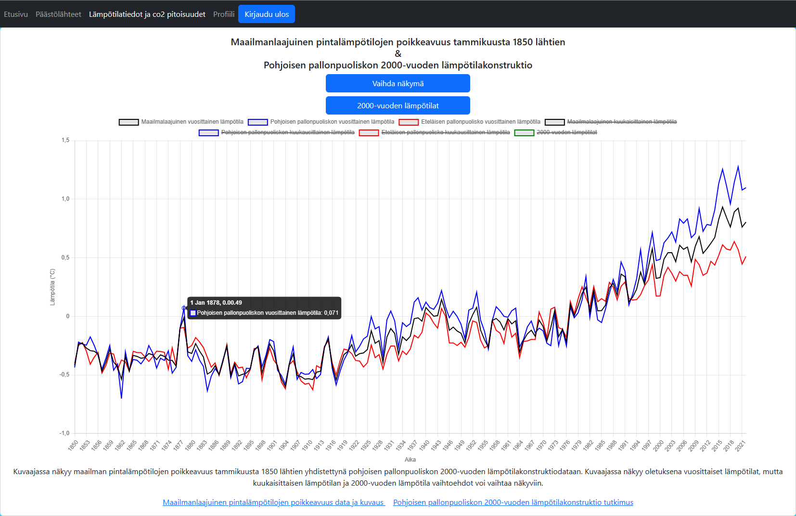

# Autumn 2022 school group project

## Projects name: Web-sovellusprojekti

## Link to app: https://group5-visualizationtool-gbn4.onrender.com/ (data for graphs may appear delayed)

## Demo video (in Finnish): https://www.youtube.com/watch?v=vOyx4rCLYqU

## Projects idea and purpose
Projects idea was to create visualization tool, that shows different types of graphs about climate change. It is also possible to create a user, which you can use to create your own custom visualization views and share them with unique URLs. User can select desired graphs and add a custom caption to create a view. All user made views can be found publicly with correct URL.

Projects purpose was to become familiar with full-stack programming and Kanban -development model.

*Picture of the first graph in the "Lämpötilatiedot ja c02 pitoisuudet" page.*

## Technologies and tools: 

### Frontend

Projects frontend was created using React.js (JavaScript library), Bootstrap (CSS framework) and CSS. For installing packages for frontend we used npm (a node package manager). Worth mentioning packages are Chart.js, React-Chartjs-2, Axios, Bootstrap and React-Bootsrap.

### Backend

Projects backend was created using JavaScript and Node.js. We also used Express.js (a web application framework) for building the API (Application Program Interface). Most important package was Mongoose, which was used for creating a connection between Backend and Database.

### Database

We used MongoDB (an open-source NoSQL database) in this project, mainly because it has fairly simple structure and it is easy to use/learn.

### UI

We designed our UI using Figma. Figma is a web-based graphics editing and user interface design app.

### Testing

For Frontend testing we used Cypress which is a End to End (E2E) testing library.

For Backend testing we used integration test approach. We used Jest and SuperTest libraries for testing API.

## Architecture and structure

### Picture of applications structure:

### Picture of how data is structured in a database:

### UI design
[Link to Figma](https://www.figma.com/file/tXrYVw573jIBt49oBs0tLg/Group5?node-id=0%3A1)

## How to run locally

1. Clone repository
2. Move to folder 'Client' and install all dependencies with command 'npm install', do the same inside a 'Server' folder.
3. Start the apps frontend with command 'npm start' inside the 'Client' folder.
4. Start the apps backend with command 'npm run devStart' inside the 'Server' folder.

## What everyone did

### Junnu Kyrö
Worked with data, made 2 graphs, made 'luo uusi näkymä' function, created the user made view page, CSS, fetch graph data from database, worked with backend/frontend, made frontend tests.

### Antti-Jussi Niku
Worked with data, made 3 graphs, delete user function, responsives, initialization of the backend, fetch graph data from database, worked with backend/frontend.

[Link to Anttis GitHub](https://github.com/ArunJ0)

### Anssi Rauhala
Worked with data, made 2 graphs, login, registed and delete view functions, CSS, worked with backend/frontend, made backend tests.

[Link to Anssis GitHub](https://github.com/luris123)

### Santtu Tiitinen
Worked with data, UI design, responsives, CSS.

[Link to Santtus GitHub](https://github.com/santtutiitinen)
